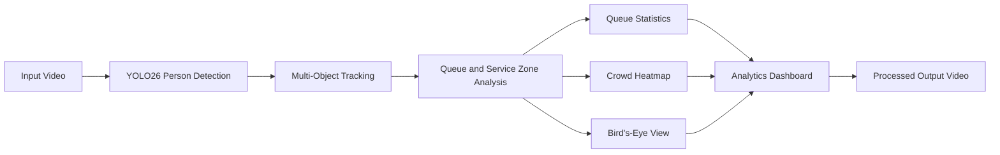

# Real-Time Crowd and Queue Analytics using YOLO26

An AI-powered computer vision system for detecting, tracking, and analysing people in video footage. The project combines YOLO26, OpenCV, multi-object tracking, custom spatial zones, and a professional dashboard to generate real-time crowd and queue insights.

> **Note:** This project uses a pretrained YOLO26 model for person detection. No custom mAP values are claimed because the model was not trained on a custom dataset for this project.

## Project Overview

The system processes a video stream and identifies people using YOLO26. Each detected person receives a persistent tracking ID, allowing the application to monitor movement across a queue zone and a service zone.

The dashboard displays:

- Live crowd and queue count
- Person tracking IDs
- Queue and service-zone overlays
- Crowd-density heatmap
- Estimated waiting time
- Service rate and average service time
- Bird's-eye occupancy view
- Processed output video

## Key Features

- Real-time person detection
- Multi-object tracking with persistent IDs
- Queue-zone occupancy monitoring
- Service-zone activity monitoring
- Crowd-density heatmap generation
- Estimated waiting-time calculation
- Total served-customer counting
- Average and maximum queue statistics
- Bird's-eye spatial visualisation
- Professional dashboard interface
- Video export for later analysis
- JSON-based zone configuration

## Tech Stack

- Python
- YOLO26
- Ultralytics
- OpenCV
- NumPy
- Deep Learning
- Computer Vision
- Multi-Object Tracking
- Video Analytics

## System Workflow



Each person follows this state sequence:

```text
Outside → In Queue → At Service Zone → Served
```

A service event is counted when a tracked person:

1. Enters the queue zone
2. Moves into the service zone
3. Remains in the service area for the required minimum time
4. Leaves the service area or disappears from the scene

## Project Structure

```text
crowd-analysis/
│
├── dashboard.py              # Dashboard, heatmap and bird's-eye rendering
├── queue_analytics.py        # Detection, tracking and queue-analysis logic
├── zone_picker.py            # Interactive queue/service zone selection
├── zones.json                # Saved polygon coordinates
├── queue.mp4                 # Input video
├── yolo26n.pt                # YOLO26 model weights
├── demo.mp4                  # Generated output video
└── README.md
```

## Installation

### 1. Clone the repository

```bash
git clone <your-repository-url>
cd crowd-analysis
```

### 2. Create a virtual environment

Windows PowerShell:

```powershell
python -m venv .venv
.\.venv\Scripts\Activate.ps1
```

### 3. Install dependencies

```powershell
python -m pip install --upgrade pip
python -m pip install ultralytics opencv-python numpy
```

## Select Queue and Service Zones

Run the zone picker:

```powershell
python zone_picker.py --source queue.mp4 --frame 30 --out zones.json
```

### Controls

| Control | Action |
|---|---|
| Left click | Add a polygon point |
| `U` | Undo the previous point |
| `R` | Reset the current polygon |
| `N` | Finish the current zone and move to the next |
| `S` | Save both zones |
| `Q` | Quit without saving |

Selection order:

```text
Queue zone → Press N → Service zone → Press S
```

Each zone must contain at least three points.

## Run the Analytics System

```powershell
python queue_analytics.py --source queue.mp4 --zones zones.json --model yolo26n.pt --imgsz 640 --conf 0.15 --save demo.mp4 --show
```

Press `Q` inside the display window to stop the program early.

## Higher-Accuracy Configuration

For improved detection of smaller or distant people, use a larger YOLO26 model and a higher inference resolution:

```powershell
python queue_analytics.py --source queue.mp4 --zones zones.json --model yolo26s.pt --imgsz 960 --conf 0.22 --tracker botsort.yaml --save demo_accurate.mp4 --show
```

A larger model can improve detection quality but requires more processing time, especially on CPU-only systems.

## Main Parameters

| Parameter | Description |
|---|---|
| `--source` | Video path, webcam index or stream URL |
| `--zones` | Path to the zone configuration JSON file |
| `--model` | YOLO26 model weights |
| `--tracker` | Tracking configuration |
| `--conf` | Detection confidence threshold |
| `--imgsz` | Inference image size |
| `--save` | Output video filename |
| `--show` | Display live analytics window |
| `--log` | Optional CSV file for service events |
| `--prior-service` | Initial estimated service time in seconds |

## Output

The application can generate:

- Annotated video with detection boxes
- Persistent tracking IDs
- Live queue count
- Crowd-density heatmap
- Queue statistics
- Bird's-eye occupancy view
- Estimated waiting time
- Service-event CSV log
- Final processed video

## Add a Dashboard Screenshot

Create an `assets` folder and add a screenshot named:

```text
assets/dashboard-preview.png
```

Then add this line near the top of the README:

```markdown

```

## Applications

This system can be adapted for airports, banks, hospitals, shopping malls, railway stations, universities, retail stores, public service centres, event venues, and smart-city monitoring.

## Limitations

- Detection quality may decrease under heavy occlusion.
- Small or distant people can be missed at lower inference resolutions.
- Waiting-time estimates require a clearly defined queue and service flow.
- General crowd footage without a real service counter produces demonstration-level queue statistics.
- CPU inference can be slower with larger YOLO models.

## Future Improvements

- Fine-tune the detector on a custom crowd dataset
- Add GPU acceleration
- Improve tracking during severe occlusion
- Support multiple queue and service zones
- Add entry and exit counting
- Store analytics in a database
- Build a web-based monitoring dashboard
- Add real-time alerts for overcrowding
- Deploy the system on edge devices
- Support CCTV and RTSP streams

## Author

**Areeba Shahid**

Computer Sceintist | Python Developer | AI and Computer Vision Enthusiast

## License

This project is intended for educational and portfolio purposes. Add an open-source license such as MIT before public distribution.
